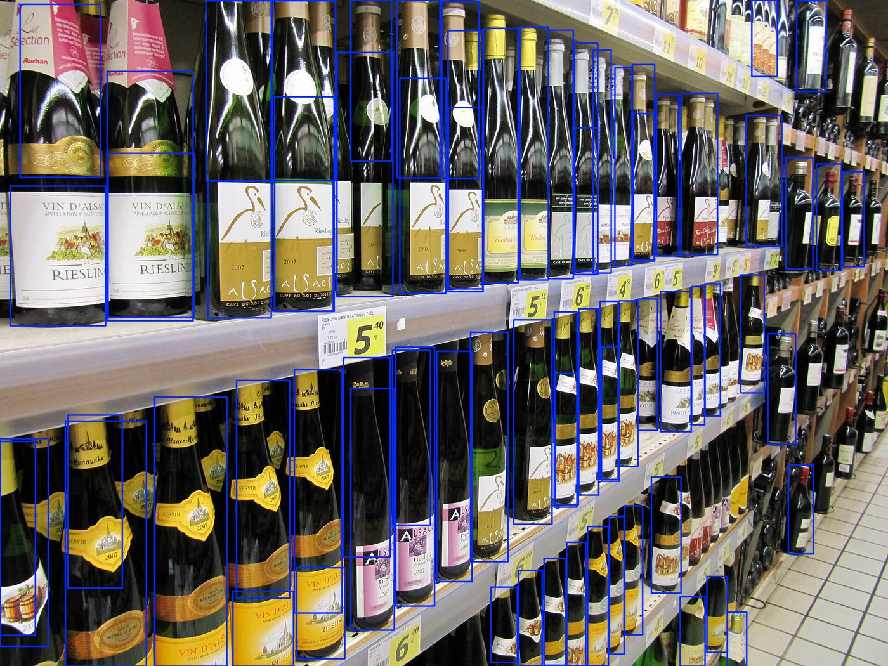
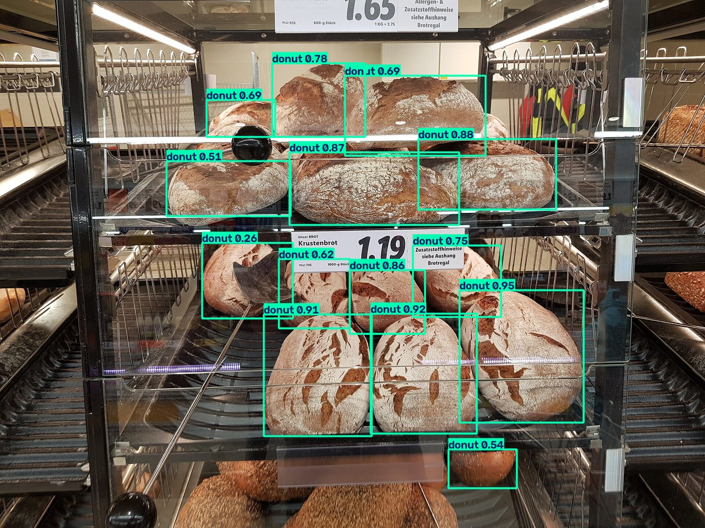
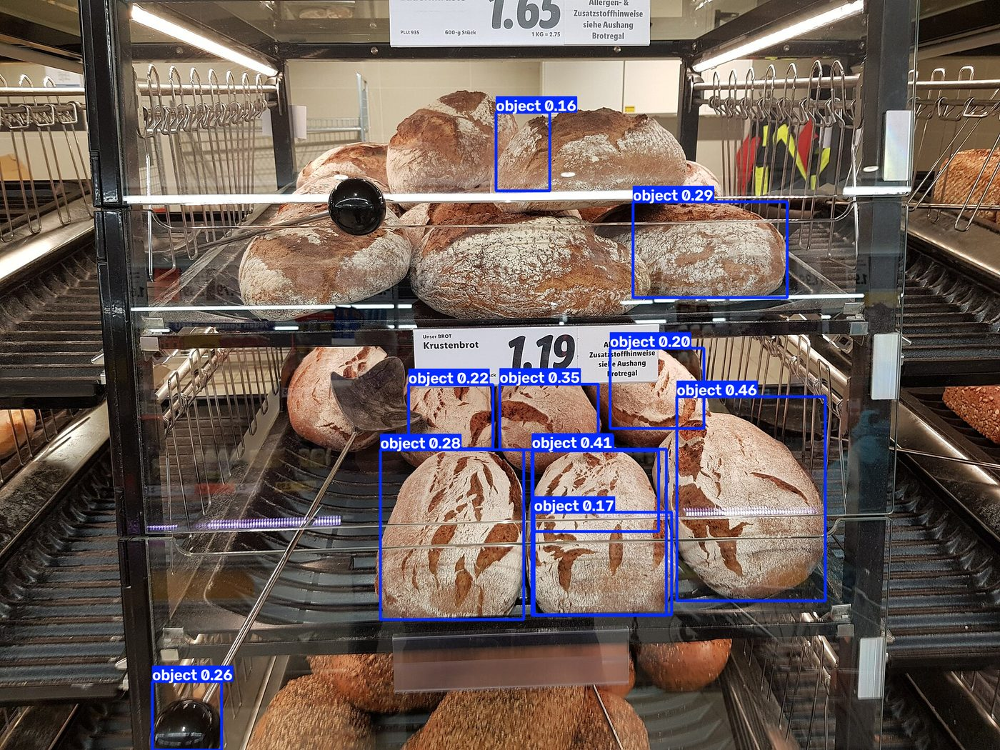
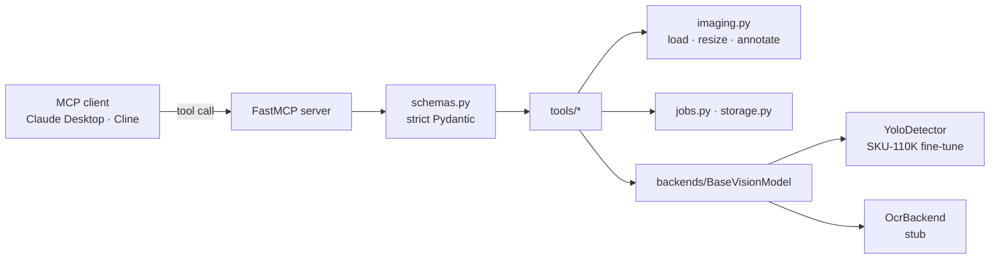
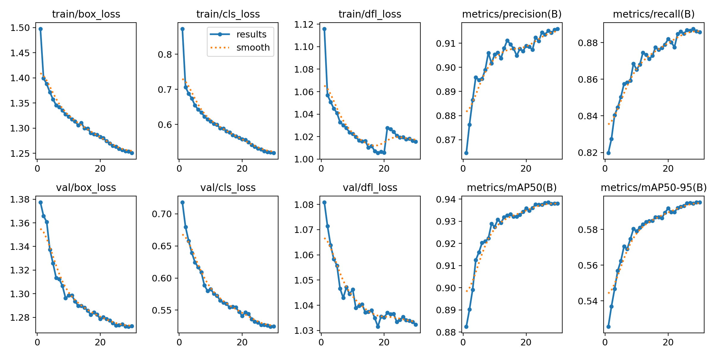

<div align="center">

# 🛒 Shelf Auditor MCP

**Point an LLM agent at a photo of a retail shelf — it counts the products,
finds the out-of-stock gaps, reads the price tags, and checks the layout
against a planogram.**

A [Model Context Protocol](https://modelcontextprotocol.io) server for
retail-shelf computer vision.




<sub><code>count_products</code> on a shelf photo — every facing boxed, with pixel + normalised coordinates and a confidence.</sub>

</div>

---

## Why this exists

Retail audit work — counting facings, catching stockouts, verifying planogram
compliance — is repetitive visual grunt work. An LLM agent with the right tools
can do it from a single phone photo. This server gives an agent those tools over
MCP, so it drops straight into Claude Desktop, Cline, or any MCP client.

It is built as a **portfolio piece**: a clean, documented, demoable MVP with a
real fine-tuned model behind it, not a pile of half-features.

## What it can do

| Tool | What it returns |
|------|-----------------|
| **`count_products`** | Per-label counts, every item's `bbox` (pixels) + `bbox_normalized` (0–1) + confidence, and an annotated image |
| **`detect_gaps`** | Empty shelf regions grouped by row, each with a width ratio vs. the row's mean product and a severity (`minor` / `moderate` / `major`) |
| **`read_price_tags`** | Price labels linked to the nearest product — *OCR backend is a documented stub for now* |
| **`check_planogram`** | `missing` / `misplaced` / `extra` / `wrong_order` deviations against a slot spec, plus a `compliant` flag |
| **`shelf_report`** | Meta-tool: runs count + gaps (+ planogram) and returns one combined JSON **and** a Markdown summary |
| `get_job_status` · `get_job_result` | Poll long-running jobs |

**Resources:** `image://{id}` · `results://{job_id}` · `annotated://{job_id}` · `models://available`<br>
**Prompts:** `count-items` · `detect-gaps` · `read-shelf` · `planogram-check`

## See it work

### Why a retail-specific detector

Same bread shelf, same resolution. Stock YOLO only knows its 80 COCO classes, so
it approximates the loaves as **"donut"** / **"cake"** — fine for a box, useless
for a label. The fine-tune has one purpose-built **"product"** class and was
trained on dense-shelf layouts, and it scores **0.938 mAP@0.5 on the SKU-110K
retail benchmark**.

| Stock YOLOv8s — COCO classes | YOLOv8s fine-tuned on SKU-110K |
|:---:|:---:|
|  |  |
| `donut 0.9`, `cake 0.7`, … | `product` (one class, any facing) |

### `shelf_report` output

```jsonc
{
  "count_products": { "total": 73, "counts": { "product": 73 } },
  "detect_gaps":    { "gap_count": 3, "rows_detected": 3,
                      "gaps": [{ "row": 0, "severity": "moderate", "width_ratio": 1.45 }, …] }
}
```

```markdown
# Shelf audit report
**Products detected:** 73
**Shelf gaps:** 3 across 3 row(s)
- row 0: moderate (×1.45 mean width)
```

## Architecture

The **MCP layer** (protocol, schema validation, job management) is kept strictly
separate from the **vision backend**. Every capability implements one interface —
`BaseVisionModel.run(image, params) -> Result` — so swapping YOLOv8 for RT-DETR,
or a local model for a cloud API, never touches MCP code.



```
src/vision_mcp/
  server.py     FastMCP instance — registers tools, resources, prompts
  schemas.py    per-tool input/output models
  config.py     pydantic settings (env prefix VISION_MCP_)
  imaging.py    path / URL / base64 → RGB array; resize; annotate
  jobs.py       async job manager      storage.py   image + result cache
  backends/     base.py + detector.py (YOLO) + ocr.py (stub) + matching.py
  tools/        one module per tool
scripts/hpc/    fine-tune the detector on a SLURM cluster
```

## Quickstart

```bash
uv sync
uv run python scripts/download_models.py     # COCO fallback weights → models/
uv run python -m vision_mcp.server           # stdio MCP server
```

Runs out of the box on the COCO fallback. For the SKU-110K accuracy in the
numbers above, fetch the fine-tune — see [`scripts/hpc/README.md`](scripts/hpc/README.md).

Wire it into a client with `examples/claude_desktop_config.json` (fix the path),
then walk through `examples/demo_walkthrough.md`.

**Try it on any image** — annotated PNGs + JSON land in `out/`:

```bash
uv run python scripts/try_image.py path/to/shelf.jpg
uv run python scripts/try_image.py shelf.jpg --slots planogram.json
```

**Poke the protocol** with the MCP Inspector:

```bash
uv run mcp dev src/vision_mcp/server.py
```

## The detector

Default weights are a **YOLOv8s fine-tuned on [SKU-110K](https://github.com/eg4000/SKU110K_CVPR19)**,
trained on the University of Twente GPU cluster (`scripts/hpc/`, one L40, 42 min).

<div align="center">

</div>

| | Value |
|---|---|
| SKU-110K val **mAP@0.5** | **0.938** |
| SKU-110K val **mAP@0.5:0.95** | **0.595** |
| Precision / Recall | 0.916 / 0.886 |
| Training | 30 epochs · imgsz 960 · 1× NVIDIA L40 · 42 min |

The detector runs class-agnostic, so its single `object` class is reported as
`"product"`. If `models/yolov8s_sku110k.pt` is missing, it falls back to
auto-downloaded COCO `yolov8n.pt` and says so in the response `notes`. To fetch
the fine-tune, follow [`scripts/hpc/README.md`](scripts/hpc/README.md) then:

```bash
export VISION_MCP_DETECTOR_WEIGHTS=yolov8s_sku110k.pt
```

## Development

```bash
uv run pytest                          # core suite is synthetic — no weights needed
uv run ruff check . && uv run mypy src

uv run python tests/fixtures/download_fixtures.py   # + real-photo integration tests
```

## Docker

```bash
docker build -t shelf-auditor .                            # CPU
docker build -f Dockerfile.cuda -t shelf-auditor:cuda .    # CUDA — run with --gpus all
```

## Limitations & roadmap

- **Price OCR is a stub.** `read_price_tags` returns `not_implemented`; the
  interface is complete. Next: wire `OcrBackend` to `python-doctr` (`ocr` extra).
- **Domain shift.** SKU-110K is dead-on, evenly-lit US grocery. On angled or dim
  store photos the fine-tune localises well but scores lower — hence
  `detector_conf` defaults to 0.2. Re-run `train_sku110k.sbatch` on in-domain
  data (`IMGSZ=1280` for the tiny facings) for a specific deployment.
- **Out of MVP scope:** video / tracking, per-client model training, batch
  folders, cloud vision backends, multi-tenant auth.

## Credits & licensing

- Code: **MIT** — see [`LICENSE`](LICENSE).
- **SKU-110K** (Goldman et al., CVPR 2019) is released for **academic /
  non-commercial** use — the shipped fine-tuned weights inherit that restriction.
  Retrain on licensed or self-collected data before commercial deployment.
- Demo photos are CC-BY from Wikimedia Commons:
  *Alsatian wines in a supermarket* by francois (CC BY 2.0);
  *Krustenbrot for sale at supermarket* by Maksym Kozlenko (CC BY-SA 4.0).
  Full list in [`tests/fixtures/SOURCES.md`](tests/fixtures/SOURCES.md).

## Config reference

Environment variables, prefix `VISION_MCP_` (see `src/vision_mcp/config.py`):

| Var | Default | |
|---|---|---|
| `DEVICE` | `auto` | `auto` / `cpu` / `cuda` |
| `DETECTOR_WEIGHTS` | `yolov8s_sku110k.pt` | file in `models/`, or an ultralytics name |
| `DETECTOR_CONF` | `0.2` | detection confidence floor |
| `DETECTOR_IMGSZ` | `960` | YOLO inference resolution |
| `MAX_EDGE_PX` | `1920` | longest image edge before inference |
| `MAX_INLINE_IMAGE_BYTES` | `4 MiB` | above this, annotated images return as a reference |
